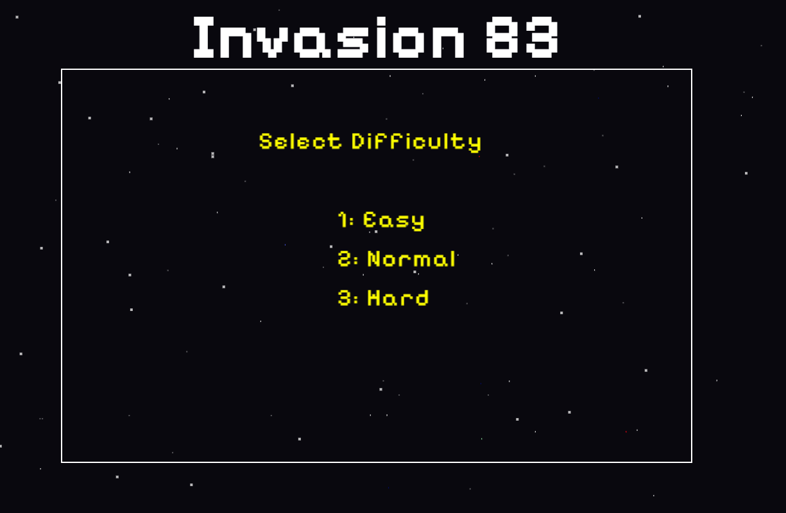
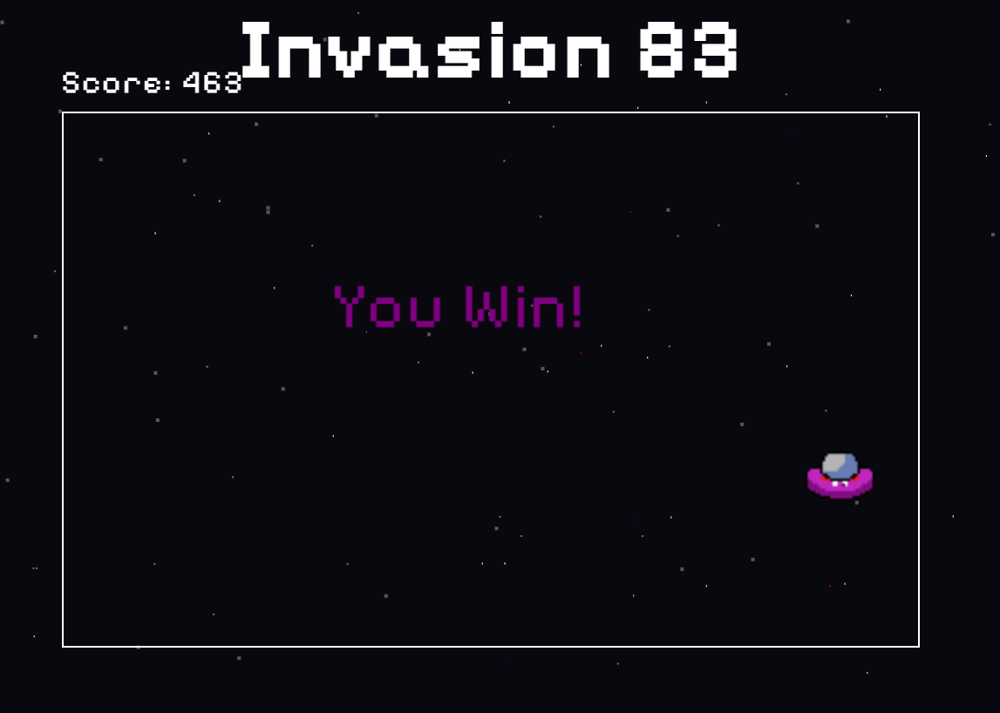
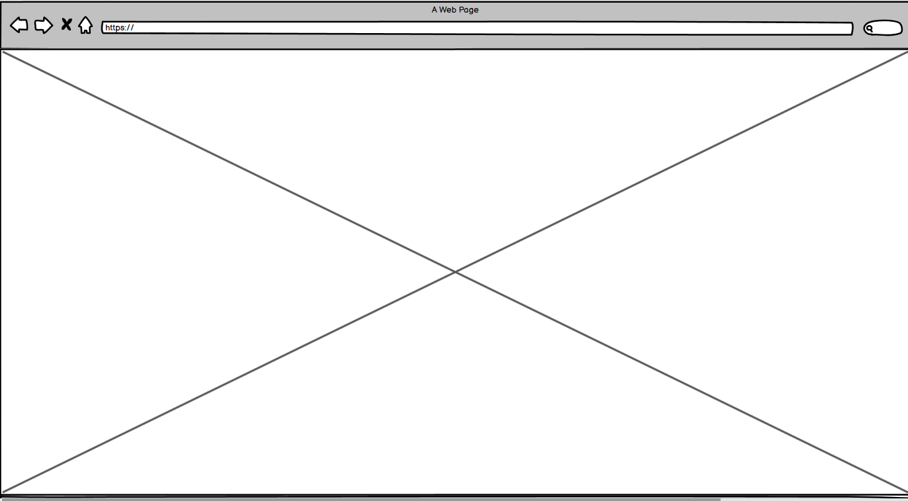
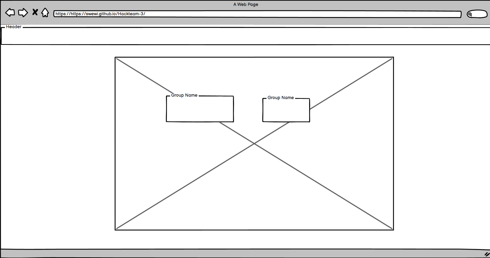
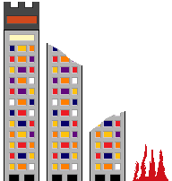
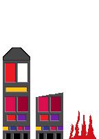
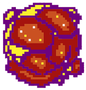
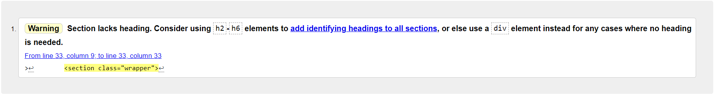
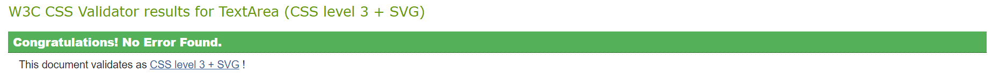
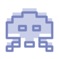

# Retro Gaming Hackathon

**Welcome to our Retro Gaming Hackathon project!** 🎮

- _An online, 8-bit, single button alien invasion game._

## About Us

We are a passionate team of developers and designers participating in the Code Institute Retro Gaming Hackathon. Our team is excited to blend our love for retro games with our technical skills to create a unique gaming experience.

Creators Kiree Bellamy, Kim Hanlon, Angela Siniavskaja, Ahmad Al Hindi, Amir Ahmed, Catherine Parrish.

## Project Overview

Welcome to "Invasion 83" an exciting alien invasion game, inspired by the Vic20 game 'blitz', you're the alien trying to destroy cities.

In "Invasion 83", you are the alien pilot. You'll have to use your bombs to clear the city below so you can land safely. You can drop only one bomb at a time, sorry no spam clicking! As you progress you gradually lose height, but remember, if you don't clear all the buildings, you're loose. If you are succesful, you win! Then you advance to the next level.

- Controls:
  - Number keys to select difficulty,
  - Space or click to fire,
  - Escape to access pause menu

# Invasion 83

### Landing Page

### Game in action

### Pause the game

.png>)

### Winner

At first, Commodore tried to promote the new home computer (our favorite C64) by releasing a few simple games. Most of them was with boring design, but they all had a certain "charm". Super Blitz was one such game released by Commodore back in 1983, and it was no exception.

In Super Blitz, you are a bomber pilot who is quickly running out of fuel. You'll have to use your bombs to clear the city below so you can land safely (how politically incorrect is that?!). Although the plane is very old, it is equipped with additional smart bombs that can "sense" their siblings, meaning that you cannot drop a bomb before the previous one hits the ground. You gradually lose height, and if you don't clear all the buildings in time, you're dead. Sometimes a cloud will block your view and make it difficult to decide when to drop the bomb. Coincidentally, King Kong is also patrolling the city below, so if you can hit the building as it goes up it, you'll get a bonus. If you land your plane safely, you'll advance to the next level, which is exactly the same story except with a different (random) city layout.

**By following this links you can learn more about origin game!**

- **Supper blitz** - [View](https://www.lemon64.com/game/super-blitz)
- **Game in action** - [View](https://www.youtube.com/watch?v=ccYSdrgWwGg)
- **Wikipedia** - [View](<https://en.wikipedia.org/wiki/Blitz_(video_game)>)

## User Interface - In Game UI

- **As a player, I want a clear and intuitive user interface that shows my score, lives, and level progress so that I can easily understand my current game status.**

  - The UI displays the score and high score.
  - UI elements should be styled to complement the retro theme.

- **As a player, I want to be able to read credits.**

  - Include a credits screen at the end of the game.

- **As a player, I want a menu in game that gives me the options.**

  - To restart the game.
  - Quit like a looser.
  - Make it so game pauses when open.

- **As a player, I want to control where the character drops the projectile using keyboard/mouse inputs so that I can interact with the game.**

  - The player can trigger a projectile drop using a key press, mouse click.

- **As a player, I want to experience different levels or stages in the game so that I can enjoy a sense of progression and challenge.**

  - The game should include multiple levels or stages with increasing difficulty.
  - Transition between levels should be smooth and provide text-based feedback.
  - Each level should offer an increased challenge.

- **As a player, I want to hear background music that complements the retro theme so that the game environment feels immersive.**

  - Background music is included and can be toggled on or off in the game settings.
  - The music should loop seamlessly and fit the 8-bit theme.
  - Sound effects are implemented for key actions (e.g., jumping, collecting items, taking damage).
  - Each sound effect should be clear and appropriate for the action it represents.
  - Sound effects should be balanced in volume and not overpower the background music.

- **As a player, I want to see instructions and controls at the start of the game so that I know how to play and what actions are available.**

  - Instructions are displayed at the start of the game.
  - Instructions should clearly describe controls and gameplay mechanics.
  - Instructions should be easy to read and navigate.

## Our Contributions

- **As a developer, I need to prepare the game for deployment on various platforms (web, desktop, etc.) so that players can access and play the game in their preferred environment.**

  - The game is packaged and configured for deployment on target platforms.
  - Platform-specific issues are resolved and documented.
  - Deployment instructions are included in the documentation.

- **As a developer, I need to ensure that the game is optimized for performance so that it runs smoothly and efficiently on target devices.**

  - The game’s performance is tested and optimized for speed and resource usage.
  - Any performance bottlenecks are identified and addressed.
  - The game should maintain consistent frame rates and responsiveness.

- **As a developer, I need to integrate various sprites (characters, enemies, items) into the game so that the game has a visually engaging experience.**

  - Sprites for the main character, enemies, and interactive items are available and correctly displayed.
  - Sprites should be loaded and rendered efficiently without causing performance issues.

- **As a developer, I need to ensure that the game's visual style matches the retro theme so that the game maintains a consistent aesthetic.**
  - Visual elements such as backgrounds, sprites, and UI components adhere to the 8-bit gaming style (e.g., pixel art).
  - The colour palette and graphical effects should reflect a classic gaming era.

## Design

- ### Wireframes

  - Welcome Page - 

  - Landing Page - 

  - Home Page Game - 

  - Pause Page - 

- ### Color Pallete

  

- ## Images/Characters

* Was createn by team member by using Pixilart [Pixalart](https://www.pixilart.com/draw) Except bomb_sprite, which comes from Freepik [Freepik](https://www.freepik.com/)

      

- ## Background
  For Star Flash effect was used Pastebin Library [Pastebin](https://pastebin.com/gEfdRwgc)
  

## Features

- Interactive elements
- Challenge

## Technologies Used

### Languages Used

- [HTML5](https://en.wikipedia.org/wiki/HTML5)
- [CSS3](https://en.wikipedia.org/wiki/Cascading_Style_Sheets)
- [JavaScript](https://en.wikipedia.org/wiki/JavaScript)

### Frameworks, Libraries & Programs Used

## Testing

The W3C Markup Validator and W3C CSS Validator Services were used to validate every page of the project to ensure there were no syntax errors in the project.

- [W3C Markup Validator](https://jigsaw.w3.org/css-validator/#validate_by_input)
  
- [W3C CSS Validator](https://jigsaw.w3.org/css-validator/#validate_by_input)
  

### Further Testing

- The Website was tested on Google Chrome, Internet Explorer, Microsoft Edge and Safari browsers.
- Friends and family members were asked to review the site and documentation to point out any bugs and/or user experience issues.

### Future addings

- The game should handle different sprite sizes and ensure they fit within its visual design.
- Reorganise JavaScript into modules for modernisation and readability please.
-  This little character will be implemented in future as a crawling spider around the buildings.
- More dificutie levels must be added.

## Getting Started

First, fork the repository. Then, go into your prefered code editor.

1. git clone [https://github.com/Swewi/Hackteam-3]
2. cd game
3. npm install
4. npm run serve

## Deployment

### GitHub Pages

The project was deployed to GitHub Pages using the following steps...

1. Log in to GitHub and locate the [GitHub Repository](https://github.com/)
2. At the top of the Repository (not top of page), locate the "Settings" Button on the menu.
   - Alternatively Click [Here](https://raw.githubusercontent.com/) for a GIF demonstrating the process starting from Step 2.
3. Scroll down the Settings page until you locate the "GitHub Pages" Section.
4. Under "Source", click the dropdown called "None" and select "Master Branch".
5. The page will automatically refresh.
6. Scroll back down through the page to locate the now published site [link](https://github.com) in the "GitHub Pages" section.

### Forking the GitHub Repository

By forking the GitHub Repository we make a copy of the original repository on our GitHub account to view and/or make changes without affecting the original repository by using the following steps...

1. Log in to GitHub and locate the [GitHub Repository](https://github.com/)
2. At the top of the Repository (not top of page) just above the "Settings" Button on the menu, locate the "Fork" Button.
3. You should now have a copy of the original repository in your GitHub account.

### Making a Local Clone

1. Log in to GitHub and locate the [GitHub Repository](https://github.com/)
2. Under the repository name, click "Clone or download".
3. To clone the repository using HTTPS, under "Clone with HTTPS", copy the link.
4. Open Git Bash
5. Change the current working directory to the location where you want the cloned directory to be made.
6. Type `git clone`, and then paste [https://github.com/YOUR-USERNAME/YOUR-REPOSITORY] in.
7. Press Enter. Your local clone will be created.

> $ git clone [https://github.com/YOUR-USERNAME/YOUR-REPOSITORY]
> Cloning into `CI-Clone`...
> remote: Counting objects: 10, done.
> remote: Compressing objects: 100% (8/8), done.
> remove: Total 10 (delta 1), reused 10 (delta 1)
> Unpacking objects: 100% (10/10), done.

Click [Here](https://help.github.com/en/github/creating-cloning-and-archiving-repositories/cloning-a-repository#cloning-a-repository-to-github-desktop) to retrieve pictures for some of the buttons and more detailed explanations of the above process.

### Content

- All content was written by the Retro Gaming Hackathon Team.

## Resources Used

| Source                                                                                                               | Location       | Notes                        |
| -------------------------------------------------------------------------------------------------------------------- | -------------- | ---------------------------- |
| [YouTube](https://www.youtube.com/)                                                                                  | Acros website  | Tutorial for troubleshouting |
| [Font Awesome](https://fontawesome.com/)                                                                             | Across website | Inspiration for icons        |
| [Fonts Google](https://fonts.google.com/)                                                                            | Across website | Font selection               |
| [Coolors](https://coolors.co/)                                                                                       | Across website | Colour palette selection     |
| [W3Schools](https://www.w3schools.com/)                                                                              | Across website | Various help pages           |
| [Pastebin](https://pastebin.com/gEfdRwgc)                                                                            | Across website | Background Star Flash        |
| [Wikipedia](https://en.wikipedia.org/)                                                                               | Across website | History of origin game       |
| [Pixilart](https://www.pixilart.com/draw)                                                                            | Across website | Chareacters creation         |
| [Balsamiq](https://balsamiq.com/?gad_source=1&gclid=EAIaIQobChMI9-DR99b-hwMV9JtQBh0I3yMEEAAYASAAEgJTpPD_BwE)         | Across website | Wireframes creation          |
| [Pixabay](https://pixabay.com/?utm_source=link-attribution&utm_medium=referral&utm_campaign=music&utm_content=69233) | Across website | Sounds liabrary              |
| [Freepic](https://www.freepik.com/)                                                                                  | Across website | Png Library                  |
| [Simple](https://www.simpleimageresizer.com/upload)                                                                  | Across website | Png Resizer                  |

### Acknowledgements

- Special mention is also deserved by our team as a whole. We learned a lot from each other, dove headfirst into new technologies and were helpful in times of need resolving coding issues.:

  - [Kiree Bellamy](https://github.com/swewi)

  - [Kim Hanlon](https://github.com/kimatron)

  - [Angela Siniavskaja](https://github.com/Angela-Sin)

  - [Ahmad Al Hindi](https://github.com/Ahmadalhindi)

  - [Amir Ahmed](https://github.com/AmirAkmed)

  - [Catherine Parrish](https://github.com/CatherineP37)
